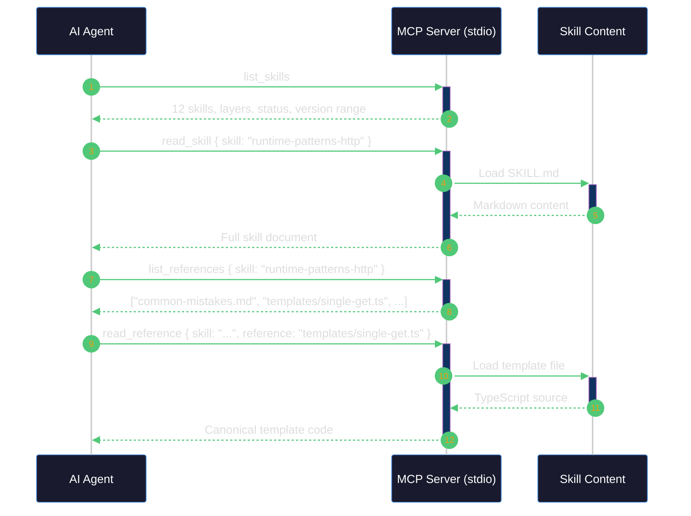
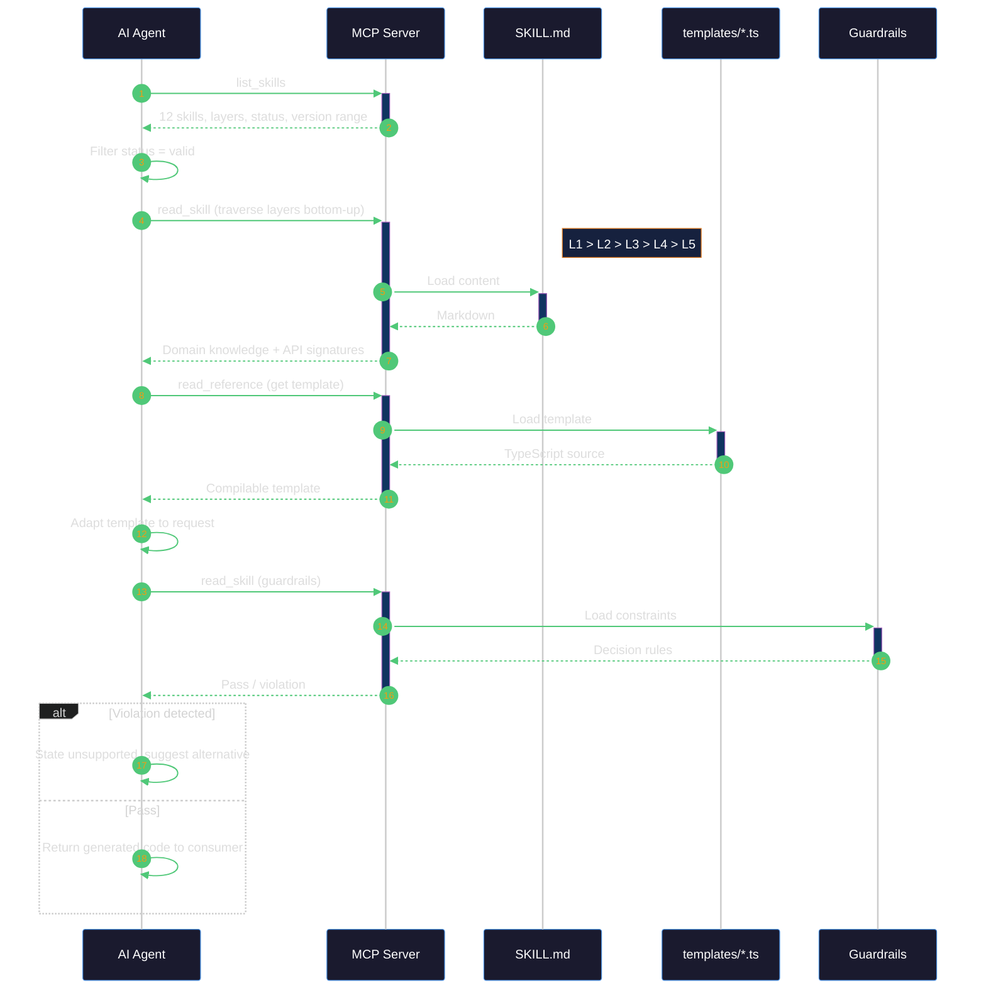
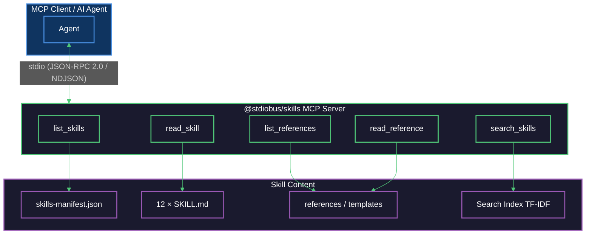
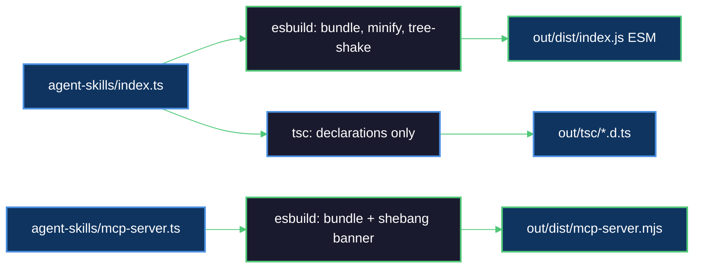

<h1 align="center" style="font-weight:500">
  <strong>MCP Agentic Skills</strong>
</h1>

<p align="center">
  Structured, validated, machine-readable skills for AI agents — delivered over <a href="https://modelcontextprotocol.io">Model Context Protocol</a> via <a href="https://github.com/stdiobus">stdio Bus</a>
</p>

<p align="center">
  <a href="https://www.npmjs.com/package/@stdiobus/skills"></a>
  <a href="https://github.com/stdiobus"></a>
  <a href="https://modelcontextprotocol.io"></a>
  <a href="https://nodejs.org"></a>
  <a href="https://www.typescriptlang.org"></a>
  <a href="https://esbuild.github.io"></a>
</p>
<p align="center">
  <a href="#available-skill-collection-runtime-web"></a>
  <a href="#the-5-layer-skill-hierarchy"></a>
  <a href="#mcp-tool-interface"></a>
  <a href="https://aws.amazon.com/lambda"></a>
  <a href="https://aws.amazon.com/cdk"></a>
  <a href="https://jestjs.io"></a>
  <a href="#test-strategy"></a>
  <a href="https://github.com/stdiobus/skills/blob/main/LICENSE"></a>
  <a href="https://github.com/stdiobus/skills"></a>
</p>

<p align="center">
  <a href="#what-is-this">What Is This</a> •
  <a href="#mcp-tool-interface">MCP Tools</a> •
  <a href="#quick-start">Quick Start</a> •
  <a href="#available-skill-collection-runtime-web">Runtime Web Skills</a> •
  <a href="#for-ai-agents">For AI Agents</a> •
  <a href="#development">Development</a> •
  <a href="#license">License</a>
</p>

---

## What Is This

`@stdiobus/skills` is an **MCP server** that exposes structured, validated agent skills over stdio transport. It is part of the [stdio Bus](https://github.com/stdiobus) ecosystem — a runtime for multi-agent systems built on native stdio communication.

The package ships as both an **executable MCP server** (`npx @stdiobus/skills`) and an **npm library** with programmatic access to skill content and metadata. Agents connect via JSON-RPC 2.0 / NDJSON over stdio, discover available skills through five MCP tools, and consume deterministic, machine-parseable knowledge to generate correct code.

This is not documentation for humans. It is a **machine-readable knowledge base** designed for LLM-based agents operating within coding assistants, agentic development environments, and multi-agent orchestration systems.

### First of Its Kind

There is no established standard for delivering structured, validated knowledge to AI agents over MCP. This project introduces the concept of **agentic skills** — machine-parseable, CI-validated skill documents served as MCP tools over stdio. The architecture, skill schema, validation pipeline, and delivery infrastructure are production-ready and designed to support multiple independent skill collections.

The first skill collection — **Runtime Web** — ships with the package. It contains **12 skills across 5 layers** that teach agents how to generate correct, type-safe code for [`@worktif/runtime`](https://runtimeweb.com), an AWS Lambda serverless framework for TypeScript microservices. New skill collections for other frameworks and domains can be added directly to the repository following the same schema.

### Why Skills Instead of Docs

Traditional documentation is written for humans: it assumes context, relies on narrative flow, and leaves room for interpretation. AI agents need something different:

| Concern | Traditional Docs | Agent Skills |
|---------|-----------------|--------------|
| Structure | Free-form prose | YAML frontmatter + ordered sections with fixed schema |
| Code examples | Illustrative snippets | Canonical templates that compile against real types |
| Error handling | "See troubleshooting" | Deterministic error catalog with pattern → cause → resolution |
| Scope boundaries | Implied | Explicit NOT SUPPORTED list with hard decision rules |
| Validation | Manual review | CI pipeline: template compilation, type existence, cross-reference integrity |
| Versioning | Changelog | Per-skill `frameworkVersionRange` with migration guides |
| Anti-patterns | Occasional warnings | Structured ❌/✅ pairs in every skill |
| Discoverability | Table of contents | 5-layer hierarchy with manifest, search, and cross-references |

Skills give agents **deterministic, validated, machine-parseable knowledge** — reducing hallucination, preventing code that doesn't compile, and enforcing framework constraints before the consumer ever sees the output.

---

## MCP Tool Interface

The server exposes five tools over [Model Context Protocol](https://modelcontextprotocol.io) (JSON-RPC 2.0 / NDJSON via stdio transport):

| Tool | Parameters | Description |
|------|-----------|-------------|
| `list_skills` | — | List all available skills with layers, metadata, and validation status |
| `read_skill` | `skill` | Read the full SKILL.md content for a specific skill |
| `list_references` | `skill` | List reference files (templates, error catalogs, guides) for a skill |
| `read_reference` | `skill`, `reference` | Read a specific reference file |
| `search_skills` | `query` | Keyword search across all skills (TF-IDF scoring with boost multipliers) |

The `skill` parameter is validated against the `SkillName` enum — only registered skill names are accepted. Invalid names return a structured error.



---

## Quick Start

### As an MCP Server

Run the server directly — any MCP-compatible client can connect over stdio:

```bash
npx @stdiobus/skills
```

Or add it to your MCP client configuration:

```json
{
  "mcpServers": {
    "@stdiobus/skills": {
      "command": "npx",
      "args": ["@stdiobus/skills"]
    }
  }
}
```

### As an npm Library

```bash
yarn add @stdiobus/skills
```

```typescript
import { SkillName } from '@stdiobus/skills';
import manifest from '@stdiobus/skills/skills-manifest';

console.log(manifest.skills.length);        // 12
console.log(manifest.frameworkVersion);      // "0.5.0-beta.2"
console.log(SkillName.RuntimePatternsHttp); // "runtime-patterns-http"
```

### Package Exports

| Export Path | Content |
|-------------|---------|
| `@stdiobus/skills` | `SkillName` enum, `Skill` and `SkillManifest` types |
| `@stdiobus/skills/skills-manifest` | `skills-manifest.json` — registry of all skills |
| `@stdiobus/skills/package.json` | Package metadata |

### Published Files

The npm package includes:

- `out/dist/index.js` — ESM library bundle (minified, tree-shaken)
- `out/dist/mcp-server.mjs` — Executable MCP server (standalone, shebang)
- `out/tsc/**/*.d.ts` — TypeScript declarations
- `agent-skills/**/SKILL.md` — All 12 skill documents
- `agent-skills/**/references/**` — Reference materials, templates, error catalog
- `agent-skills/skills-manifest.json` — Skill registry with validation status

---

## Available Skill Collection: Runtime Web

The first and currently only skill collection covers [`@worktif/runtime`](https://runtimeweb.com) — an AWS Lambda serverless framework for TypeScript microservices. It contains **12 skills organized across 5 layers**, each validated against real framework types by CI.

### The 5-Layer Skill Hierarchy

Skills are organized in a dependency-aware hierarchy. Lower layers provide foundational knowledge that higher layers build upon. An agent resolving a task traverses layers bottom-up: understand concepts first, then API surface, then patterns, then constraints, then diagnostics.

```mermaid
%%{init: {'theme':'dark', 'themeVariables':{'primaryColor':'#1a1a2e','primaryTextColor':'#fff','primaryBorderColor':'#4a90e2','lineColor':'#50c878','secondaryColor':'#16213e','tertiaryColor':'#0f3460'}}}%%
flowchart LR
  subgraph L1[Layer 1 Concepts]
    direction TB
    CO[concepts]
    LC[lifecycle]
  end

  subgraph L2[Layer 2 API]
    direction TB
    AC[api-core]
    AI[api-integrations]
  end

  subgraph L3[Layer 3 Patterns]
    direction TB
    PH[patterns-http]
    PA[patterns-async]
    PD[patterns-data-events]
    SW[ssr-and-web]
  end

  subgraph L4[Layer 4 Guardrails]
    CG[constraints-and-guardrails]
  end

  subgraph L5[Layer 5 Diagnostics]
    direction TB
    ED[errors-and-diagnostics]
    VM[versioning-and-migration]
    VC[validation-and-ci]
  end

  L1 --> L2 --> L3 --> L4 --> L5

  classDef layer1 fill:#0f3460,stroke:#4a90e2,stroke-width:2px,color:#fff
  classDef layer2 fill:#0f3460,stroke:#50c878,stroke-width:2px,color:#fff
  classDef layer3 fill:#0f3460,stroke:#f39c12,stroke-width:2px,color:#fff
  classDef layer4 fill:#1a1a2e,stroke:#e67e22,stroke-width:2px,color:#fff
  classDef layer5 fill:#1a1a2e,stroke:#9b59b6,stroke-width:2px,color:#fff

  class CO,LC layer1
  class AC,AI layer2
  class PH,PA,PD,SW layer3
  class CG layer4
  class ED,VM,VC layer5
```



### Skills Catalog

#### Layer 1 — Concepts

| Skill | Description |
|-------|-------------|
| **runtime-concepts** | Product definition, domain model, Ties pattern, Snapshot pattern, multi-stack CDK architecture, 9 IntegrationKinds, scope boundaries (what IS and IS NOT supported) |
| **runtime-lifecycle** | Complete consumer lifecycle: Initialize → Define → Configure → Implement → Build → Deploy → Test → Upgrade |

#### Layer 2 — API

| Skill | Description |
|-------|-------------|
| **runtime-api-core** | Exact TypeScript signatures for `MicroserviceDefinition`, `LambdaDefinition`, `TiesConstructors`, `LambdaEvent`, `InitFunction`. Generic parameters, field semantics, import paths |
| **runtime-api-integrations** | Configuration interfaces for all 9 IntegrationKinds (`http`, `sqs`, `eventbridge`, `s3`, `dynamodb`, `sns`, `kinesis`, `schedule`, `direct`). 5 AuthConfig types. CDK construct vs string references |

#### Layer 3 — Patterns

| Skill | Templates | Description |
|-------|-----------|-------------|
| **runtime-patterns-http** | `single-get.ts`, `crud-microservice.ts`, `jwt-auth.ts`, `cognito-auth.ts` | HTTP endpoint patterns: GET, CRUD, JWT/Cognito authentication, CORS, path parameters |
| **runtime-patterns-async** | `sqs-worker.ts`, `eventbridge-fanout.ts`, `sns-pubsub.ts`, `kinesis-processor.ts`, `scheduled-task.ts` | Async event-driven patterns: batch processing, partial failure reporting, idempotency |
| **runtime-patterns-data-events** | `s3-trigger.ts`, `dynamodb-stream.ts` | Data-driven event patterns: S3 object notifications, DynamoDB Streams with CDC |
| **runtime-ssr-and-web** | — | SSR React with `runtime()` entry point, `BrowserProviderStack`, hydration rules |

#### Layer 4 — Guardrails

| Skill | Description |
|-------|-------------|
| **runtime-constraints-and-guardrails** | All hard constraints (Lambda <10MB, browser <500KB, SDK v3 only, CDK L2/L3 only), complete NOT SUPPORTED list, hard decision rules, dependency externalization rules |

#### Layer 5 — Diagnostics

| Skill | Description |
|-------|-------------|
| **runtime-errors-and-diagnostics** | Structured error catalog: BUILD-xxx, DEPLOY-xxx, RUNTIME-xxx, TYPE-xxx. Each entry: pattern → meaning → causes → resolution → decision rule |
| **runtime-versioning-and-migration** | Version-specific guidance for `>=0.5.0 <1.0.0`. Breaking changes 0.4.x → 0.5.0. Compatibility matrix. Migration steps |
| **runtime-validation-and-ci** | CI validation pipeline (7 stages), `skills-manifest.json` structure, skill update process |

### Skill Document Structure

Every SKILL.md follows a fixed schema with YAML frontmatter and 6 ordered sections:


```yaml
---
name: runtime-{skill-name}           # Must match directory name
description: >                        # Multi-line description for agent context
  What this skill covers and when to use it.
license: Elastic-2.0
compatibility: Requires @worktif/runtime >=0.5.0 <1.0.0
metadata:
  author: worktif
  version: "1.0.0"
  framework: "@worktif/runtime"
  frameworkVersionRange: ">=0.5.0 <1.0.0"
  layer: "3"                          # 1–5
  layerName: "Patterns"               # Concepts | API | Patterns | Guardrails | Diagnostics
---
```

### The Framework Being Documented

`@worktif/runtime` is an AWS Lambda serverless framework. Key concepts that skills teach agents about:

- **Ties pattern** — Typed dependency injection via class constructors (not instances). The framework instantiates; the consumer declares.
- **Snapshot pattern** — Cold-start caching. An `init` function runs once, returns a cached object available to all warm invocations via `event.snapshot`.
- **LambdaDefinition\<TTies, TSnapshot, TIntegration\>** — The core type for defining Lambda functions with typed ties, snapshot, and integration-specific events.
- **MicroserviceDefinition** — Groups Ties classes, an optional init function, and an array of Lambda definitions.
- **9 IntegrationKinds** — `http`, `sqs`, `eventbridge`, `s3`, `dynamodb`, `sns`, `kinesis`, `schedule`, `direct`.
- **5 AuthConfig types** — `none`, `iam`, `jwt`, `cognito`, `custom`.
- **Multi-stack CDK model** — `RuntimeInfraStack` (slow-changing base), `BrowserProviderStack` (optional SSR), `RuntimeWebStack` (microservices), `RuntimeAwakeStack` (optional local debugging).

#### Minimal Example

```typescript
import { MicroserviceDefinition, LambdaDefinition } from '@worktif/runtime';

class UsersService {
  async getUser(id: string): Promise<{ id: string; name: string }> {
    return { id, name: 'Alice' };
  }
}

type GetUserTies = { userService: UsersService };

const getUserHandler: LambdaDefinition<GetUserTies> = {
  id: 'get-user',
  ties: { userService: UsersService },       // Class constructor, not instance
  handler: async (event, context) => {
    const user = await event.ties.userService.getUser(event.pathParameters?.id ?? '');
    return { statusCode: 200, body: JSON.stringify(user) };
  },
  http: { method: 'GET', path: '/users/{id}' },
};

export const usersService: MicroserviceDefinition = {
  ties: [],
  lambdas: [getUserHandler],
};
```

---

## For AI Agents

### How to Consume Skills

If you are an AI agent or an agentic system integrating this package, follow this consumption protocol:



**Protocol steps in detail:**

1. **Discover skills** — Call `list_skills` to get all skills with layers, validation status, and framework version range. Only consume skills with `"status": "valid"`.
2. **Traverse layers bottom-up** — Need to understand the framework? Start at Layer 1. Need to generate code? Layer 2 (API types) → Layer 3 (templates). Need to validate? Layer 4. Error? Layer 5.
3. **Use canonical templates** — Call `list_references` and `read_reference` to get templates from `references/templates/*.ts`. These are compilable TypeScript validated against real framework types. Copy and adapt — don't generate from scratch.
4. **Respect the NOT SUPPORTED list** — Layer 4 contains an explicit list of unsupported features. Do not fabricate framework features.
5. **Follow hard decision rules** — Each skill contains deterministic decision rules: given condition X, the only correct action is Y. Do not improvise alternatives.

### Skill Selection Heuristic

| Consumer Request | Primary Skill | Supporting Skills |
|-----------------|---------------|-------------------|
| "What is this framework?" | `runtime-concepts` | `runtime-lifecycle` |
| "Create a GET endpoint" | `runtime-patterns-http` | `runtime-api-core`, `runtime-api-integrations` |
| "Process SQS messages" | `runtime-patterns-async` | `runtime-api-integrations` |
| "React to S3 uploads" | `runtime-patterns-data-events` | `runtime-api-integrations` |
| "Add SSR to my app" | `runtime-ssr-and-web` | `runtime-concepts`, `runtime-lifecycle` |
| "Is X supported?" | `runtime-constraints-and-guardrails` | `runtime-concepts` |
| "I'm getting error Y" | `runtime-errors-and-diagnostics` | `runtime-constraints-and-guardrails` |
| "Upgrade from 0.4 to 0.5" | `runtime-versioning-and-migration` | `runtime-api-core` |
| "Are these skills up to date?" | `runtime-validation-and-ci` | — |

### Framework Domain Terminology

Skills use specific terminology. Agents should adopt the same terms:

| Canonical Term | Do NOT Use |
|---------------|------------|
| **ties** | "dependencies", "DI", "injection" |
| **consumer** | "user", "developer" |
| **integration** | "trigger", "event source" |
| **LambdaDefinition** | "handler definition" |

---

## Architecture

### How It Works



The MCP server is a standalone Node.js executable bundled with esbuild. On startup it:

1. Loads `skills-manifest.json` — the registry of all skills with layer, status, and version range
2. Pre-loads all 12 SKILL.md files into memory
3. Builds a TF-IDF search index with boost multipliers (name/description 3×, layerName 2×, body 1×)
4. Registers five MCP tools and connects to stdio transport

All skill content is resolved from disk relative to the server bundle, with directory traversal protection on `read_reference`.

### Directory Layout

```
agent-skills/
├── mcp-server.ts                     # MCP server entry point (stdio transport)
├── index.ts                          # Library entry point (SkillName enum, types)
├── types.ts                          # SkillName enum, Skill and SkillManifest interfaces
├── skills-manifest.json              # Registry: 12 skills, layers, validation status
├── lib/
│   ├── file-resolver.ts              # Disk I/O for skill files and manifest
│   └── search-index.ts              # TF-IDF search index builder
├── tools/                            # MCP tool handlers (one file per tool)
│   ├── list-skills.ts
│   ├── read-skill.ts
│   ├── list-references.ts
│   ├── read-reference.ts
│   └── search-skills.ts
├── scripts/
│   └── validate-skills.ts            # Structural validator (7 validation stages)
├── __tests__/                        # Jest + fast-check test suites
│
├── runtime-concepts/                 # Layer 1
│   ├── SKILL.md
│   └── references/
├── runtime-lifecycle/                # Layer 1
├── runtime-api-core/                 # Layer 2
├── runtime-api-integrations/         # Layer 2
├── runtime-patterns-http/            # Layer 3 (with templates/)
├── runtime-patterns-async/           # Layer 3 (with templates/)
├── runtime-patterns-data-events/     # Layer 3 (with templates/)
├── runtime-ssr-and-web/              # Layer 3
├── runtime-constraints-and-guardrails/ # Layer 4
├── runtime-errors-and-diagnostics/   # Layer 5
├── runtime-versioning-and-migration/ # Layer 5
└── runtime-validation-and-ci/        # Layer 5
```

### Build System



| Target | Entry | Output | Purpose |
|--------|-------|--------|---------|
| **ESM Bundle** | `agent-skills/index.ts` | `out/dist/index.js` | Library (SkillName enum, types) |
| **MCP Server** | `agent-skills/mcp-server.ts` | `out/dist/mcp-server.mjs` | Executable MCP server with `#!/usr/bin/env node` |
| **Declarations** | `agent-skills/index.ts` | `out/tsc/*.d.ts` | TypeScript type declarations |

---

## Development

### Prerequisites

- Node.js ≥20.0.0
- Yarn 1.22.x (classic)
- TypeScript 5.4+

### Commands

```bash
# Install dependencies
yarn install

# Full build (clean + esbuild bundle + tsc declarations)
yarn build

# Type-check without emitting
yarn typecheck

# Validate all 12 skill structures (7-stage pipeline)
yarn validate

# Run all tests (Jest + fast-check)
yarn test

# Run tests with coverage (threshold: 80%)
yarn test:coverage

# Full CI pipeline (typecheck + validate + test)
yarn ci

# Clean build output
yarn clean
```

### Test Strategy

Tests use both example-based (Jest) and property-based (fast-check) approaches:

| Test Suite | What It Validates |
|------------|-------------------|
| `mcp-server/tools/` | Unit tests for each MCP tool handler |
| `mcp-server/integration/` | Full MCP protocol round-trip tests (stdio) |
| `mcp-server/properties/` | Property-based tests: enum-manifest sync, search ordering, content readability |
| `mcp-server/lib/` | Unit tests for file-resolver and search-index |
| `validators/` | Unit tests for each validation function (name, frontmatter, body, error catalog, terminology) |
| `skills/` | Skill content verification (cross-references, layer assignments, content structure) |
| `templates/` | Template compilation against real `@worktif/runtime` types |
| `checkpoints/` | End-to-end validation of all 12 skills |
| `ci/` | CI integration tests |

### Validation Pipeline

The `yarn validate` command runs a 7-stage structural validation:


| Stage | What It Checks |
|-------|---------------|
| Structural validation | SKILL.md exists, frontmatter is complete, body follows section order |
| Template compilation | All `references/templates/*.ts` compile with `tsc --noEmit` |
| API existence check | Referenced types exist in `@worktif/runtime` public exports |
| Error catalog validation | `error-catalog.json` conforms to schema, IDs are unique |
| Cross-reference integrity | All `../skill-name/SKILL.md` links resolve |
| Terminology check | Canonical terms used consistently (no "dependencies" for ties, etc.) |
| Manifest update | `skills-manifest.json` updated with validation results |

### Skills Manifest

`skills-manifest.json` is the source of truth for skill validation state:

```json
{
  "version": "1.0.0",
  "frameworkVersion": "0.5.0-beta.2",
  "skills": [
    {
      "name": "runtime-concepts",
      "layer": 1,
      "versionRange": ">=0.5.0 <1.0.0",
      "status": "valid",
      "lastValidated": "2026-05-02T12:00:00.000Z"
    }
  ]
}
```

Status values: `"valid"` | `"outdated"` | `"failed"`.

---

## Compatibility

| Dependency | Version |
|-----------|---------|
| `@worktif/runtime` | ≥0.5.0 <1.0.0 |
| Node.js | ≥20.0.0 |
| TypeScript | 5.4+ |
| AWS SDK | v3 only (modular `@aws-sdk/client-*`) |
| aws-cdk-lib | 2.x |
| React | 19.x (dev) / 16.14–18.x (peer) |
| React Router | 7.7+ |

---

## Contributing

### Adding a New Skill

1. Create `agent-skills/{skill-name}/SKILL.md` following the standard schema
2. Add `references/` directory with supporting materials
3. Add the enum member to `SkillName` in `agent-skills/types.ts`
4. Add the entry to `agent-skills/skills-manifest.json`
5. Run `yarn validate` to verify structural correctness
6. Run `yarn test` to verify all tests pass
7. Update cross-references in related skills

### Updating Skills After API Changes

1. Run `yarn ci` — failed skills are identified
2. Update affected templates and SKILL.md content
3. Re-run `yarn validate` — all skills must pass
4. Update `frameworkVersion` in `skills-manifest.json`

---

## License

[Apache-2.0](LICENSE) © 2026-present [Raman Marozau](mailto:raman@worktif.com), Target Insight Function contributors
