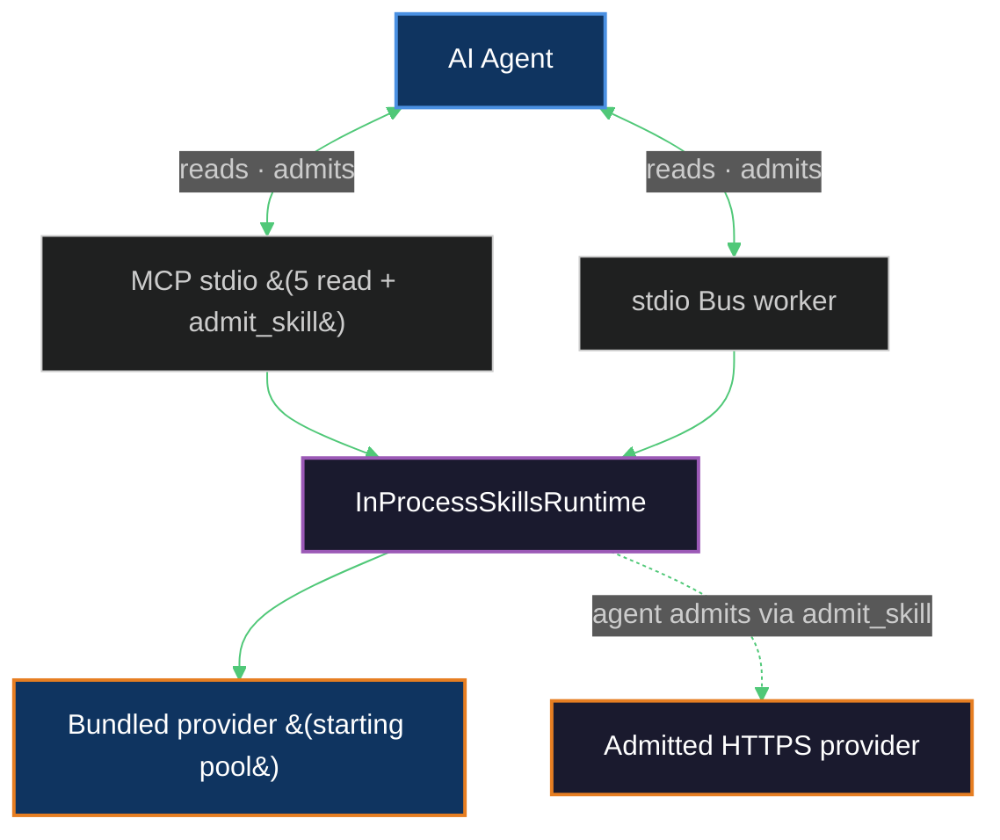

<h1 align="center" style="font-weight:500">
  <strong>MCP Agentic Skills</strong>
</h1>

<p align="center">
  <strong>Give an agent a skill surface that is safe by default and open at the provider boundary.</strong>
  The packaged MCP server ships <strong>five read tools</strong> the agent uses to discover and read skills, plus an <strong><code>admit_skill</code></strong> tool: when the agent needs a skill that was never bundled, it <strong>admits an external HTTPS provider</strong> into the <strong>same live, in-process pool</strong> it already reads — <strong>no host code</strong>.
</p>

<p align="center">
  This guide is operational. Follow it to do four things, in order:
  <br/>
  <strong>1.</strong> connect the server to an agent · <strong>2.</strong> let the agent read skills · <strong>3.</strong> have the agent admit a skill from an external provider via <code>admit_skill</code> · <strong>4.</strong> let the agent read it back from the same pool.
</p>

<p align="center">
  <a href="https://www.npmjs.com/package/@stdiobus/skills"></a>
  <a href="https://modelcontextprotocol.io"></a>
  <a href="https://github.com/stdiobus"></a>
  <a href="https://nodejs.org"></a>
</p>

<p align="center">
  <a href="#operating-contract">Operating Contract</a> •
  <a href="#1--host--connect-the-server-to-an-agent">1 · Connect</a> •
  <a href="#2--agent--read-the-skill-surface">2 · Read</a> •
  <a href="#3--agent--admit-a-skill-from-an-external-provider">3 · Admit</a> •
  <a href="#4--agent--read-the-newly-admitted-skill">4 · Read again</a> •
  <a href="#whats-already-in-the-pool">What's in the pool</a>
</p>

---

## Operating Contract

The rules the operations below run under. Read this once; it is the contract, not a list of apologies.

- **You are the host operator.** You install the package and connect the MCP surface to an agent. WHERE you want to scope which origins are admissible, you set an optional operator **origin allowlist**. The **agent is the consumer** — it reads skills and, when it needs one that was never bundled, admits an external provider through the `admit_skill` tool.
- **`npx @stdiobus/skills` ships six MCP tools** — the five read tools **plus `admit_skill`**. Admission is a first-class, **agent-invokable** MCP tool, additive to the read tools; an agent admits over MCP with **no host code**.
- **Admission is explicit and bounded.** The `http` provider fetches one SKILL document over HTTPS (platform TLS) under a byte bound and a finite timeout. A rejected source returns `{ code: 'quarantined', stage, cause }` — returned, never thrown.
- **Safe by default.** Admitted providers are untrusted by default; acquisition is bounded and fetched content is treated as data. WHERE an operator sets the origin allowlist (deployment config / environment), only the HTTPS origins it lists are admissible and any other is quarantined **before** content is acquired; WHERE unset, public HTTPS origins are permitted under those controls. The allowlist is a **restriction**, never a hidden on/off — `admit_skill` is always present.
- **One runtime, two transports.** Admitted skills live in the same in-process runtime served over MCP stdio and the stdio Bus worker. Nothing new is spawned.
- **This release** admits providers **in-process** over HTTPS. It has **no** marketplace, automatic admission, or remote placement. Credentials, where needed, are consumed from [`@stdiobus/workers-registry`](https://github.com/stdiobus/workers-registry); no OAuth or token storage is implemented here.

---

## 1 · Host — connect the server to an agent

Add the server to your MCP client (Cursor, Claude Desktop, Kiro, Windsurf, …). The client launches the process and talks to it over stdio (JSON-RPC 2.0 / NDJSON):

```json
{
  "mcpServers": {
    "@stdiobus/skills": {
      "command": "npx",
      "args": ["-y", "@stdiobus/skills"]
    }
  }
}
```

**Result:** the agent now has the skill surface over the starting pool — the five read tools plus `admit_skill`. Nothing admitted yet.

---

## 2 · Agent — read the skill surface

The agent has **five read operations**. Each is deterministic and total — an invalid input returns a typed error, never a crash. They behave **identically for bundled skills and for admitted ones**.

| Operation | You ask | You get |
|-----------|---------|---------|
| `list_skills()` | nothing | the manifest: `version`, `frameworkVersion`, `skills[]` (`name`, `layer`, `versionRange`, `status`, `lastValidated`, opt. `collection`). **First call** — see the pool and which are `status: "valid"`. |
| `search_skills({ query })` | a task in words | a ranked `[{ skill, score, description, layer, layerName }]`. **Pick the skill.** |
| `read_skill({ skill })` | a skill name | the full `SKILL.md` body. Unknown name → typed `not_found`. |
| `list_references({ skill })` | a skill name | reference paths, e.g. `["common-mistakes.md", "templates/jwt-auth.ts", …]`. |
| `read_reference({ skill, reference })` | skill + path | the file body (a compilable template). Path traversal is rejected. |

```jsonc
// → search_skills({ query: "authenticated http endpoint" })
[
  { "skill": "runtime-patterns-http",    "score": 243.0, "layer": 3, "layerName": "Patterns", "description": "… JWT-authenticated HTTP templates …" },
  { "skill": "runtime-api-integrations", "score": 98.4,  "layer": 2, "layerName": "API",      "description": "… all 9 IntegrationKind configs …" },
  { "skill": "runtime-patterns-async",   "score": 30.1,  "layer": 3, "layerName": "Patterns", "description": "… SQS / EventBridge / SNS templates …" }
]
// then: read_skill({ skill: "runtime-patterns-http" }) → full body
//       read_reference({ skill: "runtime-patterns-http", reference: "templates/jwt-auth.ts" }) → compilable template
```

> **Loop bottom-up by layer** when reading: Concepts → API → Patterns → Guardrails → Diagnostics. And **respect each skill's NOT SUPPORTED list** — if `runtime-constraints-and-guardrails` says a feature does not exist, do not invent it. In generated code use the framework's terms: **ties** (not "DI"), **consumer** (not "user"), **integration** (not "trigger"), **LambdaDefinition** (not "handler definition").

---

## 3 · Agent — admit a skill from an external provider

**This is the operation that matters: the agent gives itself a skill the package did not ship with — over MCP, with no host code.** `admit_skill` is a default tool, additive to the five read tools. The agent calls it; the server runs the production `skills.add.v1` admission path **in-process**, against a real public HTTPS origin — nothing mocked.

| Field | Required | Meaning |
|-------|----------|---------|
| `factoryId` | yes | the external factory to use. `"http"` is the one shipped (HTTPS fetch). |
| `namespace` | yes | the namespace the admitted provider claims; its skills are addressed under it. `bundled` is reserved. |
| `url` | yes | the HTTPS URL of the SKILL document to acquire. A non-HTTPS origin (or one outside the operator allowlist) is rejected **before** any fetch. |
| `maxContentBytes` | no | per-acquisition size ceiling (defaults to the shipped interim bound). |
| `timeoutMs` | no | per-operation timeout (defaults to 30s). |

```jsonc
// → admit_skill({ factoryId: "http", namespace: "external", url: "https://example.com/SKILL.md" })
//   success → text content: the admitted provider identity + the record-only contentHash
//             { "descriptor": { … }, "contentHash": "<hex sha-256 digest>" }
//   rejected → isError: true, text: "<stage>: <cause>"   (a typed quarantine, returned, never thrown)
```

When the agent calls it, the server validates the config (the operator origin allowlist is consulted here, before any fetch), fetches the SKILL document over HTTPS under the size and time bounds, records a content hash, claims the provider's namespace, and either registers it into the live pool or returns the typed quarantine naming the stage that rejected it. The agent branches on `isError` — it does not need to know the stages to operate.

The admitted provider is materialized **in-process on the same runtime the read tools serve — no new bus or worker is spawned** — so it is **immediately discoverable and readable on the same running server instance** (step 4).

> The same admission path is also reachable **programmatically** — over the stdio Bus `skills.add.v1` wire method and via the `@stdiobus/skills/runtime` composition API (`runtime.request(AdmissionCapabilities.add, …)`). Both drive the one `AdmissionController`; no new bus or worker is spawned on either path.

---

## 4 · Agent — read the newly admitted skill

Nothing new for the agent to learn: the admitted skill answers the **same** operations as the bundled ones.

```jsonc
// before admit:  list_skills() → 17 skills
// after  admit:  list_skills() → 18 skills, including { "name": "<admitted>", "provider": "external", … }
// → read_skill({ skill: "<admitted>" }) → the document fetched over HTTPS, served from the same pool
```

That is the whole product in one loop: **the host connects a safe-by-default surface, the agent reads, the agent admits an outside skill via `admit_skill`, the agent reads more — through one runtime.**

---

## Two transports

Both surfaces — **MCP stdio** and the **stdio Bus worker** — sit behind **one** `InProcessSkillsRuntime`. The bundled provider and any admitted provider are reachable over both; an agent reads **and** admits over either surface, and admitting a provider materializes it in-process, so nothing new is spawned.


```mermaid
%%{init: {'theme':'dark', 'themeVariables':{'primaryColor':'#1a1a2e','primaryTextColor':'#fff','primaryBorderColor':'#4a90e2','lineColor':'#50c878','secondaryColor':'#16213e','tertiaryColor':'#0f3460'}}}%%
flowchart TB
  AG[AI Agent] <-->|reads · admits| MCP[MCP stdio &#40;5 read + admit_skill&#41;]
  AG <-->|reads · admits| BUS[stdio Bus worker]
  MCP --> RT[InProcessSkillsRuntime]
  BUS --> RT
  RT --> BUNDLED[Bundled provider &#40;starting pool&#41;]
  RT -.agent admits via admit_skill.-> ADMITTED[Admitted HTTPS provider]
  style AG fill:#0f3460,stroke:#4a90e2,stroke-width:2px,color:#fff
  style RT fill:#1a1a2e,stroke:#9b59b6,stroke-width:2px,color:#fff
  style BUNDLED fill:#0f3460,stroke:#e67e22,stroke-width:2px,color:#fff
  style ADMITTED fill:#1a1a2e,stroke:#e67e22,stroke-width:2px,color:#fff
```

---

## What's already in the pool

The starting pool is **17 skills** under the reserved `bundled` namespace — there so an agent is useful on day one, before you admit anything. They are CI-validated against real framework types: **14 `runtime-*` skills across 5 layers + 3 `stdiobus-sdk-*` skills.**

<details>
<summary><strong>Runtime Web — 14 skills (an agent traverses bottom-up: Concepts → API → Patterns → Guardrails → Diagnostics)</strong></summary>

| Layer | Skill | Covers |
|-------|-------|--------|
| 1 | `runtime-concepts` | Domain model, Ties, Snapshot, multi-stack CDK, 9 IntegrationKinds, scope boundaries |
| 1 | `runtime-lifecycle` | Initialize → Define → Configure → Implement → Build → Deploy → Test → Upgrade |
| 2 | `runtime-api-core` | Signatures: `MicroserviceDefinition`, `LambdaDefinition`, `TiesConstructors`, `LambdaEvent`, `InitFunction` |
| 2 | `runtime-api-integrations` | All 9 IntegrationKinds, 5 AuthConfig types, CDK construct vs string references |
| 3 | `runtime-patterns-http` | GET, CRUD, JWT/Cognito auth, CORS, path parameters (with templates) |
| 3 | `runtime-patterns-async` | SQS, EventBridge, SNS, Kinesis, schedule — batch, partial failure, idempotency |
| 3 | `runtime-patterns-data-events` | S3 triggers, DynamoDB Streams / CDC (with templates) |
| 3 | `runtime-ssr-and-web` | SSR React with `runtime()`, `BrowserProviderStack`, hydration rules |
| 3 | `runtime-acceleration` | Acceleration seam at the `LambdaBuilder` chokepoint; `acceleration.kata` config, synth-time transform |
| 3 | `runtime-multiplatform` | `RuntimeConfig.platforms`, `PlatformConfig`, shallow-merge resolution, `--platform` targeting |
| 4 | `runtime-constraints-and-guardrails` | Hard constraints, complete NOT SUPPORTED list, decision rules, dependency externalization |
| 5 | `runtime-errors-and-diagnostics` | Structured error catalog (BUILD/DEPLOY/RUNTIME/TYPE): pattern → cause → resolution |
| 5 | `runtime-versioning-and-migration` | Version guidance `>=0.5.0 <1.0.0`, breaking changes, compatibility matrix |
| 5 | `runtime-validation-and-ci` | CI validation pipeline, `skills-manifest.json` structure, skill update process |

</details>

<details>
<summary><strong>stdio Bus SDKs — 3 skills</strong></summary>

| Skill | Language | Package / Crate | Covers |
|-------|----------|-----------------|--------|
| `stdiobus-sdk-cpp` | C++ | `libstdio_bus` | Bus/AsyncBus, BusBuilder, CMake, status + exception modes, event loop |
| `stdiobus-sdk-node` | Node.js | `@stdiobus/node` | StdioBus, native/Docker backends, `request()`/`send()`, TCP/Unix listeners, ACP transport |
| `stdiobus-sdk-rust` | Rust | `stdiobus-client` | Async-first (Tokio), BusBuilder, native/Docker backends, `request()`/`notify()`, subscriptions |

</details>

A bundled `SKILL.md` is YAML frontmatter + six fixed sections (Overview → When to Use → Core Concepts → Instructions → Common Mistakes → References). An admitted external provider is **not** required to follow this shape — the read operations treat any provider's body as content.

---

## Exports & published files

| Export | Use |
|--------|-----|
| `@stdiobus/skills` | `SkillName` enum, `Skill` / `SkillManifest` types |
| `@stdiobus/skills/mcp-server` | the default MCP server entry point — five read tools **plus** `admit_skill` |
| `@stdiobus/skills/runtime` | the admission composition API (programmatic / stdio Bus admission, as in the note under step 3) |
| `@stdiobus/skills/skills-manifest` | `skills-manifest.json` |
| `@stdiobus/skills/skills/*/SKILL.md` · `.../references/*` | direct access to bundled documents and templates |

Binary: `mcp-skills` → the default MCP server (five read tools + `admit_skill`). Published artifacts: `out/dist/{index,mcp-server,runtime}.mjs`, `out/tsc/**/*.d.ts`, all bundled `SKILL.md` + `references/**`, and `skills-manifest.json`.

---

## Development

```bash
yarn install         # install dependencies
yarn build           # clean + esbuild bundles + tsc declarations
yarn typecheck       # type-check without emitting
yarn validate        # structural validation of all 17 bundled SKILL.md files
yarn test            # all tests (Jest + fast-check)
yarn ci              # typecheck → validate → test
```

- Node.js ≥20.0.0 · Yarn 1.22.x (classic) · TypeScript 5.4+.
- Build is esbuild (three ESM bundles) plus `tsc` declarations only; Node built-ins externalized.
- Tests are example-based and property-based, plus a mock-free **live E2E** that packs the package, installs it into a clean consumer, and proves the step 3 → step 4 path (admit + federate + read-back) over **both** transports against a real public HTTPS origin. Coverage gate **80%**.

---

## License

[Apache-2.0](https://github.com/stdiobus/skills/blob/main/LICENSE) © Raman Marozau — part of the [stdio Bus](https://github.com/stdiobus) ecosystem.
