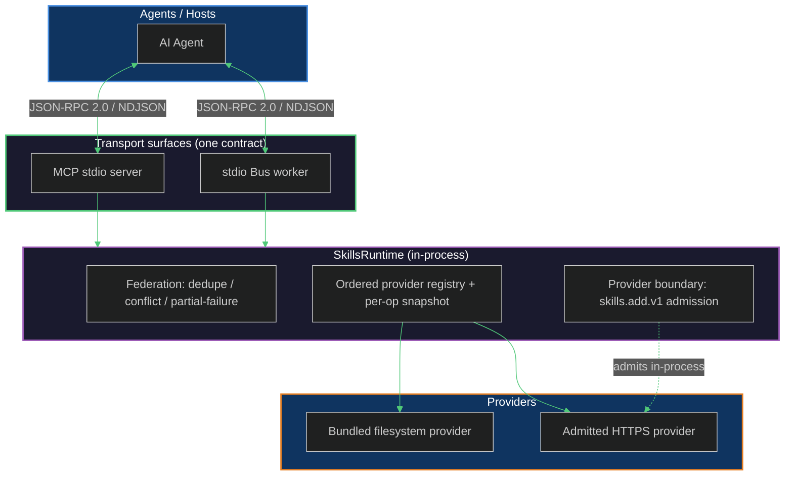
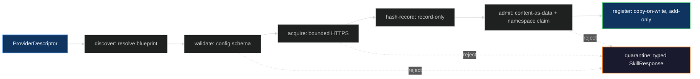

<h1 align="center" style="font-weight:500">
  <strong>MCP Agentic Skills</strong>
</h1>

<p align="center">
  Structured, validated <strong>skills</strong> that teach AI agents to write correct code — served over <a href="https://modelcontextprotocol.io">MCP</a>, and extensible with new skill sources <strong>at runtime</strong>
</p>

<p align="center">
  <a href="https://www.npmjs.com/package/@stdiobus/skills"></a>
  <a href="https://github.com/stdiobus"></a>
  <a href="https://modelcontextprotocol.io"></a>
  <a href="https://nodejs.org"></a>
  <a href="https://www.typescriptlang.org"></a>
</p>
<p align="center">
  <a href="#provider-boundary"></a>
  <a href="#system-shape"></a>
  <a href="#quick-start"></a>
  <a href="#bundled-provider-catalog"></a>
  <a href="https://jestjs.io"></a>
  <a href="#development"></a>
  <a href="https://github.com/stdiobus/skills/blob/main/LICENSE"></a>
</p>

<p align="center">
  <a href="#what-is-this">What Is This</a> •
  <a href="#what-you-get">What You Get</a> •
  <a href="#system-shape">System Shape</a> •
  <a href="#provider-boundary">Provider Boundary</a> •
  <a href="#safety-model">Safety</a> •
  <a href="#quick-start">Quick Start</a> •
  <a href="#runtime-admission">Runtime Admission</a> •
  <a href="#bundled-provider-catalog">Bundled Skills</a> •
  <a href="#development">Development</a>
</p>

---

## What Is This

**A skill** is a structured, machine-readable document that teaches an AI coding agent how to do **one specific thing correctly** — for example, *"how to write an authenticated HTTP endpoint in this framework."* Unlike documentation written for humans, every skill has a fixed schema, compilable example templates, an explicit *"what is NOT supported"* list, and a structured error catalog. The agent reads the skill and produces correct, type-checked code instead of guessing.

`@stdiobus/skills` does two things with skills:

1. **Serves them to agents.** It runs a small server that any MCP-compatible AI agent (Cursor, Claude Desktop, Kiro, Windsurf, …) connects to over stdio. The agent asks *"what skills exist?"*, *"read skill X"*, *"search skills"* — and gets deterministic, validated answers. **17 skills ship in the box.**
2. **Lets the skill set grow at runtime.** Skills used to be fixed at install time. Now a host can point the runtime at an **external skill source** (for example, an HTTPS URL); the runtime fetches it, checks that it is safe, and adds it to the **same pool** the agent reads from. An agent's skill set is no longer frozen.

### How it works, in one minute

1. An AI agent connects to the server over stdio (JSON-RPC 2.0 / NDJSON).
2. It calls `list_skills` → reads the skills it needs with `read_skill` → uses the templates to write correct code. By default that is the whole story: **read-only, 17 bundled skills, five tools.**
3. *(Optional, opt-in)* A host enables admission and says *"add the skill source at this URL."* The runtime fetches the content over HTTPS, runs it through safety checks (size limit; treat content as data and never execute it; a namespace rule so an external source cannot impersonate the bundled skills), and registers it.
4. From then on the new skill appears in `list_skills` / `read_skill` **alongside** the bundled ones — over the MCP server **and** over the stdio Bus, because both are the same engine underneath.

> The default `npx @stdiobus/skills` executable is **read-only**: it serves the 17 bundled skills through five tools and does **not** add external sources. Growing the set is an opt-in capability a host wires up explicitly — see [Runtime Admission](#runtime-admission).

In the precise terms used below, that makes this a **federated skills runtime** (one engine serving many skill providers over two transports) **with an open, governed provider boundary** (the safe path by which an external provider is admitted). The rest of this README defines those pieces.

---

## What You Get

| Surface | Import / Command | What it does |
|---------|------------------|--------------|
| **Read-only MCP server** | `npx @stdiobus/skills` | The five stable MCP tools over stdio, serving the bundled skills provider. No admission. |
| **Library** | `@stdiobus/skills` | `SkillName` enum + `Skill` / `SkillManifest` types and the skills manifest. |
| **Runtime composition API** | `@stdiobus/skills/runtime` | The building blocks to compose an **admission-capable** runtime: the `SkillsRuntime`, provider registry/views, the bundled filesystem provider, the HTTPS provider blueprint, the `AdmissionController` + `skills.add.v1` handler, namespace governance, and the MCP server builder. |
| **Same runtime over the bus** | `@stdiobus/skills/runtime` | The identical in-process runtime, driven by a stdio Bus worker — no new bus or worker is spawned for a provider. |

Two transport surfaces (**MCP stdio** and **stdio Bus**) sit behind **one** `SkillsRuntime` contract. The bundled provider works the same way over both; an admitted provider becomes reachable over both.

---

## System Shape

The system has two layers behind a single contract. Higher layers build on lower ones; nothing below is rewritten to add what is above.

- **Federated runtime** — one `SkillsRuntime` contract serving every operation (`read`, `list`, `search`, `getReferences`, `readReference`, plus the open `request` seam). Every result is a returned-never-thrown `SkillResponse` carrying provenance. Skill sources are **providers** behind a capability-optional contract; an ordered registry federates them (aggregate `list`/`search`, FQID dedupe, conflict surfacing, partial-failure resilience). The same contract runs **in-process** and over the **stdio Bus**.
- **Provider boundary** — descriptor-based admission through `skills.add.v1`: a serializable `ProviderDescriptor` crosses, a typed `ProviderBlueprint` rebuilds the provider **in-process**, and a staged pipeline validates, acquires, governs, and registers it. New providers become visible to subsequent operations (add-only).


```mermaid
%%{init: {'theme':'dark', 'themeVariables':{'primaryColor':'#1a1a2e','primaryTextColor':'#fff','primaryBorderColor':'#4a90e2','lineColor':'#50c878','secondaryColor':'#16213e','tertiaryColor':'#0f3460'}}}%%
flowchart TB
  subgraph CLIENTS["Agents / Hosts"]
    AG[AI Agent]
  end

  subgraph TRANSPORTS["Transport surfaces (one contract)"]
    direction LR
    MCP[MCP stdio server]
    BUS[stdio Bus worker]
  end

  subgraph RUNTIME["SkillsRuntime (in-process)"]
    direction TB
    FED[Federation: dedupe / conflict / partial-failure]
    REG[Ordered provider registry + per-op snapshot]
    ADM[Provider boundary: skills.add.v1 admission]
  end

  subgraph PROVIDERS["Providers"]
    direction TB
    BUNDLED[Bundled filesystem provider]
    ADMITTED[Admitted HTTPS provider]
  end

  AG <-->|JSON-RPC 2.0 / NDJSON| MCP
  AG <-->|JSON-RPC 2.0 / NDJSON| BUS
  MCP --> RUNTIME
  BUS --> RUNTIME
  REG --> BUNDLED
  ADM -.admits in-process.-> ADMITTED
  REG --> ADMITTED

  style CLIENTS fill:#0f3460,stroke:#4a90e2,stroke-width:2px,color:#fff
  style TRANSPORTS fill:#1a1a2e,stroke:#50c878,stroke-width:2px,color:#fff
  style RUNTIME fill:#1a1a2e,stroke:#9b59b6,stroke-width:2px,color:#fff
  style PROVIDERS fill:#0f3460,stroke:#e67e22,stroke-width:2px,color:#fff
```

Both transport surfaces wrap the **same** in-process runtime; admitting a provider in-process makes it reachable over both, with **no new bus or worker spawned**. `worker-hosted` and `remote` placements are descriptor-shaped, but this release executes **in-process** placement only.

---

## Provider Boundary

The provider boundary is how a provider the runtime was **not** born with crosses in and federates. The external entry point is the versioned `skills.add.v1` capability over the existing `request` seam — not a new core method, and not a default MCP tool.


```mermaid
%%{init: {'theme':'dark', 'themeVariables':{'actorBkg':'#1a1a2e','actorBorder':'#4a90e2','actorTextColor':'#fff','signalColor':'#50c878','signalTextColor':'#ddd','noteBkgColor':'#16213e','noteTextColor':'#fff','noteBorderColor':'#e67e22','activationBkgColor':'#0f3460','activationBorderColor':'#9b59b6','sequenceNumberColor':'#f39c12'}}}%%
flowchart LR
  D[ProviderDescriptor] --> DISC[discover: resolve blueprint]
  DISC --> VAL[validate: config schema]
  VAL --> ACQ[acquire: bounded HTTPS]
  ACQ --> HASH[hash-record: record-only]
  HASH --> ADMIT[admit: content-as-data + namespace claim]
  ADMIT --> REG[register: copy-on-write, add-only]
  VAL -.reject.-> Q[quarantine: typed SkillResponse]
  ACQ -.reject.-> Q
  ADMIT -.reject.-> Q

  style D fill:#0f3460,stroke:#4a90e2,stroke-width:2px,color:#fff
  style REG fill:#0f3460,stroke:#50c878,stroke-width:2px,color:#fff
  style Q fill:#1a1a2e,stroke:#e67e22,stroke-width:2px,color:#fff
```

- **Placement model** — a serializable `ProviderDescriptor` (`{ factoryId, config, namespace, trust, capabilityVersions }`) crosses the boundary; a typed `ProviderBlueprint<TConfig>` keyed by `factoryId` rebuilds the provider in-process. A live provider object never crosses a transport.
- **Staged admission** — `discover → validate → acquire → hash-record → admit → register`. Each stage returns a typed result; the **first** failing stage short-circuits to a **quarantine** (a returned `SkillResponse`, never a throw) that names the rejecting stage and preserves the underlying typed cause.
- **Federation** — once admitted, `list`/`search` aggregate the bundled provider **and** the admitted provider through the same runtime mechanics: FQID dedupe, conflict surfacing (same FQID, differing content → conflict, never a silent pick), and partial-failure resilience (an admitted-provider outage returns bundled results plus a recorded source error).
- **Visibility** — each operation captures one provider snapshot at entry; admission is **copy-on-write and add-only**, so a newly admitted provider is visible to the **next** operation without disturbing an in-flight one.

---

## Safety Model

The provider boundary treats an external provider as untrusted by default and earns authority through the pipeline — it is not granted by the descriptor.

- **Namespace ownership / anti-spoofing** — a provider may mint FQIDs only under a namespace it owns. The reserved `bundled:` namespace and any already-owned namespace are rejected at admission, and a registered provider returning an out-of-namespace FQID on **any** operation is rejected at the provider-output boundary (keyed on the real child provider id, never masked by aggregation).
- **Content-as-data** — acquired content is never executed, `eval`'d, or `require`'d, and never derives authority. The admitted provider stays untrusted; nothing it returns promotes its trust.
- **Bounded acquisition** — HTTPS fetches enforce `maxContentBytes` (rejected before materialization where the origin declares its size, and while streaming) and a finite timeout with `AbortSignal` cancellation, so a slow or oversized origin cannot hang the runtime. Over-limit content returns a typed `content_too_large`.
- **Quarantine** — every rejection is a typed, returned `SkillResponse` (`{ code: 'quarantined', stage, cause }`); the registry is left unchanged.
- **Content hash** — a SHA-256 digest is recorded on provenance for the admitted content. It is **record-only**: it plays no part in dedupe, equality, or conflict detection.
- **Auth reuse** — where a provider requires authentication, credentials are **consumed** from [`@stdiobus/workers-registry`](https://github.com/stdiobus/workers-registry) over the bus and mapped to request headers. This package implements **no** OAuth, token storage, or refresh of its own; the default is a no-credential adapter for public origins.
- **TLS** — HTTPS uses the platform's standard TLS trust as-is. There is no certificate-pinning or custom-trust feature.

---

## Quick Start

### As an MCP server

Add the server to your MCP client (Cursor, Claude Desktop, Kiro, Windsurf, etc.). The client starts the process and talks to it over stdio:

```json
{
  "mcpServers": {
    "@stdiobus/skills": {
      "command": "npx",
      "args": ["-y", "@stdiobus/skills"]
    }
  }
}
```

The server exposes five tools over [Model Context Protocol](https://modelcontextprotocol.io) (JSON-RPC 2.0 / NDJSON via stdio):

| Tool | Parameters | Description |
|------|-----------|-------------|
| `list_skills` | — | List all skills with layers, metadata, and validation status |
| `read_skill` | `skill` | Read the full SKILL.md content for a skill |
| `list_references` | `skill` | List reference files (templates, error catalogs, guides) for a skill |
| `read_reference` | `skill`, `reference` | Read a specific reference file |
| `search_skills` | `query` | Keyword search across all skills (TF-IDF scoring with boost multipliers) |

The `skill` parameter is validated against the `SkillName` enum — only registered skill names are accepted; invalid names return a structured error. `read_reference` is protected against directory traversal.

### As a library

```bash
yarn add @stdiobus/skills
```

```typescript
import { SkillName } from '@stdiobus/skills';
import manifest from '@stdiobus/skills/skills-manifest';

console.log(manifest.skills.length);          // 17
console.log(manifest.frameworkVersion);       // "0.5.3-kata.1"
console.log(SkillName.RuntimePatternsHttp);   // "runtime-patterns-http"
```

### Package exports

| Export Path | Content |
|-------------|---------|
| `@stdiobus/skills` | `SkillName` enum, `Skill` and `SkillManifest` types |
| `@stdiobus/skills/mcp-server` | The read-only MCP server entry point (programmatic import) |
| `@stdiobus/skills/runtime` | The runtime composition API (admission-capable hosts — see below) |
| `@stdiobus/skills/skills-manifest` | `skills-manifest.json` — the skill registry |
| `@stdiobus/skills/skills/*/SKILL.md` | Direct access to skill documents |
| `@stdiobus/skills/skills/*/references/*` | Direct access to reference materials and templates |

### Published files

- `out/dist/index.mjs` — ESM library bundle (`SkillName`, types)
- `out/dist/mcp-server.mjs` — the executable read-only MCP server (standalone, shebang)
- `out/dist/runtime.mjs` — the runtime composition API (`@stdiobus/skills/runtime`)
- `out/tsc/**/*.d.ts` — TypeScript declarations
- `agent-skills/**/SKILL.md` — all 17 skill documents
- `agent-skills/**/references/**` — reference materials, templates, error catalog
- `agent-skills/skills-manifest.json` — the skill registry with validation status

---

## Runtime Admission

> Admission is **not** a default MCP tool (by design). The default executable stays read-only. A host that wants admission **composes** it from `@stdiobus/skills/runtime` and exposes it on a surface it controls. Enabling admission is an explicit, separate act.

The composition wires one shared provider view and namespace table into both the runtime and the `AdmissionController`, so an admitted provider is materialized **in-process** and becomes visible to the next operation — with no new bus or worker:

```typescript
import {
  AdmissionCapabilities,
  AdmissionCapabilityHandler,
  AdmissionController,
  FilesystemSkillProvider,
  HttpSkillProviderBlueprint,
  InProcessSkillsRuntime,
  MutableProviderView,
  NamespaceOwnershipTable,
  OperationBudget,
  ProviderBlueprintRegistry,
  Sha256ContentHasher,
} from '@stdiobus/skills/runtime';

// Bundled provider seeds a mutable view shared by the runtime AND the admission controller.
const view = new MutableProviderView([new FilesystemSkillProvider({ packageRoot })]);
const namespaces = new NamespaceOwnershipTable();

// One blueprint registry; the HTTPS blueprint is the external factory that ships in the box.
const blueprints = new ProviderBlueprintRegistry();
blueprints.register(new HttpSkillProviderBlueprint());

const controller = new AdmissionController(
  blueprints,
  view,
  namespaces,
  new OperationBudget(30_000),
  new Sha256ContentHasher(),
);
const admission = new AdmissionCapabilityHandler(controller);

// The runtime reads from the SAME view the controller's register stage mutates; pass the
// namespace table (anti-spoofing on every operation) and the in-process admission handler.
const runtime = new InProcessSkillsRuntime(view, undefined, namespaces, admission);

// Admit an external provider over the production `skills.add.v1` path (acquires over real HTTPS).
const result = await runtime.request(AdmissionCapabilities.add, {
  factoryId: 'http',
  namespace: 'external',
  config: { url: 'https://example.com/SKILL.md', maxContentBytes: 1_000_000, timeoutMs: 30_000 },
});
// result.ok === true → the admitted skill is now federated with the bundled provider and
// readable through the same runtime; a rejection is a returned `{ code: 'quarantined', stage, cause }`.
```

The same building blocks back the stdio Bus worker: a dispatch table maps the `skills.add.v1` wire method to the same `AdmissionController`, so admission works identically over the bus — again with no new bus or worker spawned.

---

## Bundled Provider Catalog

The skills that ship in the box are served by the **bundled filesystem provider** under the reserved `bundled:` namespace. They are CI-validated against real framework types and are the reference collection the read-only server exposes by default — **17 skills** across two collections.

### Collection 1 — Runtime Web (14 skills, 5 layers)

Covers [`@worktif/runtime`](https://runtimeweb.com), an AWS Lambda serverless framework for TypeScript microservices. Skills are organized in a dependency-aware hierarchy; an agent traverses bottom-up: concepts → API → patterns → guardrails → diagnostics.


```mermaid
%%{init: {'theme':'dark', 'themeVariables':{'primaryColor':'#1a1a2e','primaryTextColor':'#fff','primaryBorderColor':'#4a90e2','lineColor':'#50c878','secondaryColor':'#16213e','tertiaryColor':'#0f3460'}}}%%
flowchart LR
  subgraph L1[Layer 1 Concepts]
    CO[concepts]
    LC[lifecycle]
  end
  subgraph L2[Layer 2 API]
    AC[api-core]
    AI[api-integrations]
  end
  subgraph L3[Layer 3 Patterns]
    PH[patterns-http]
    PA[patterns-async]
    PD[patterns-data-events]
    SW[ssr-and-web]
    AX[acceleration]
    MP[multiplatform]
  end
  subgraph L4[Layer 4 Guardrails]
    CG[constraints-and-guardrails]
  end
  subgraph L5[Layer 5 Diagnostics]
    ED[errors-and-diagnostics]
    VM[versioning-and-migration]
    VC[validation-and-ci]
  end
  L1 --> L2 --> L3 --> L4 --> L5
  classDef l fill:#0f3460,stroke:#4a90e2,stroke-width:2px,color:#fff
  class CO,LC,AC,AI,PH,PA,PD,SW,AX,MP,CG,ED,VM,VC l
```

| Layer | Skill | Description |
|-------|-------|-------------|
| 1 | **runtime-concepts** | Domain model, Ties pattern, Snapshot pattern, multi-stack CDK, 9 IntegrationKinds, scope boundaries |
| 1 | **runtime-lifecycle** | Consumer lifecycle: Initialize → Define → Configure → Implement → Build → Deploy → Test → Upgrade |
| 2 | **runtime-api-core** | Exact signatures: `MicroserviceDefinition`, `LambdaDefinition`, `TiesConstructors`, `LambdaEvent`, `InitFunction` |
| 2 | **runtime-api-integrations** | Config for all 9 IntegrationKinds, 5 AuthConfig types, CDK construct vs string references |
| 3 | **runtime-patterns-http** | HTTP patterns: GET, CRUD, JWT/Cognito auth, CORS, path parameters (with templates) |
| 3 | **runtime-patterns-async** | Async/event-driven: SQS, EventBridge, SNS, Kinesis, schedule — batch, partial failure, idempotency |
| 3 | **runtime-patterns-data-events** | Data-driven: S3 triggers, DynamoDB Streams / CDC (with templates) |
| 3 | **runtime-ssr-and-web** | SSR React with `runtime()`, `BrowserProviderStack`, hydration rules |
| 3 | **runtime-acceleration** | Provider-agnostic acceleration seam at the `LambdaBuilder` chokepoint; the `acceleration.kata` config block, enabled/`unlicensedBehavior` precedence, lazy optional-peer isolation, synth-time transform model |
| 3 | **runtime-multiplatform** | Multi-platform deploy: `RuntimeConfig.platforms`, `PlatformConfig` shape, shallow-merge resolution vs global config, per-platform resource naming, `--platform` CLI targeting |
| 4 | **runtime-constraints-and-guardrails** | Hard constraints, complete NOT SUPPORTED list, hard decision rules, dependency externalization |
| 5 | **runtime-errors-and-diagnostics** | Structured error catalog (BUILD/DEPLOY/RUNTIME/TYPE): pattern → cause → resolution |
| 5 | **runtime-versioning-and-migration** | Version guidance `>=0.5.0 <1.0.0`, breaking changes, compatibility matrix |
| 5 | **runtime-validation-and-ci** | CI validation pipeline, `skills-manifest.json` structure, skill update process |

### Collection 2 — stdio Bus SDKs (3 skills)

Covers the **stdio Bus** platform itself — the C runtime and its language SDKs that manage worker processes over JSON-RPC 2.0 / NDJSON.

| Skill | Language | Package / Crate | Description |
|-------|----------|-----------------|-------------|
| **stdiobus-sdk-cpp** | C++ | `libstdio_bus` | Bus/AsyncBus, BusBuilder, CMake, status + exception modes, event loop `step()`/`poll_fd()` |
| **stdiobus-sdk-node** | Node.js | `@stdiobus/node` | StdioBus, native/Docker backends, `request()`/`send()`, TCP/Unix listeners, ACP transport |
| **stdiobus-sdk-rust** | Rust | `stdiobus-client` | Async-first (Tokio), BusBuilder, native/Docker backends, `request()`/`notify()`, subscriptions |

### Every SKILL.md follows a fixed schema

YAML frontmatter (`name`, `description`, `license`, `compatibility`, `metadata`) followed by six ordered sections: **Overview → When to Use → Core Concepts → Instructions → Common Mistakes → References**. Layer-3 pattern skills include compilable `references/templates/*.ts` validated against real framework types.

### For agents consuming the bundled skills

| Consumer Request | Primary Skill | Supporting |
|-----------------|---------------|------------|
| "What is this framework?" | `runtime-concepts` | `runtime-lifecycle` |
| "Create a GET endpoint" | `runtime-patterns-http` | `runtime-api-core`, `runtime-api-integrations` |
| "Process SQS messages" | `runtime-patterns-async` | `runtime-api-integrations` |
| "React to S3 uploads" | `runtime-patterns-data-events` | `runtime-api-integrations` |
| "Is X supported?" | `runtime-constraints-and-guardrails` | `runtime-concepts` |
| "I'm getting error Y" | `runtime-errors-and-diagnostics` | `runtime-constraints-and-guardrails` |
| "Create a stdio Bus in C++ / Node / Rust" | `stdiobus-sdk-*` | — |

Terminology agents should adopt: **ties** (not "dependencies"/"DI"), **consumer** (not "user"), **integration** (not "trigger"), **LambdaDefinition** (not "handler definition").

---

## Architecture

The MCP server is a thin adapter over the `SkillsRuntime`; the bus worker is another adapter over the **same** in-process runtime. All skill content is resolved from disk relative to the server bundle, with directory-traversal protection on reference reads.

```
agent-skills/
├── mcp-server.ts                 # Read-only MCP server entry point (stdio)
├── index.ts                      # Library entry (SkillName, types)
├── runtime-bootstrap.ts          # @stdiobus/skills/runtime — composition API
├── skills-manifest.json          # Registry: 17 skills, layers, validation status
├── lib/                          # build-server, file-resolver, search-index, tool-render
├── tools/                        # The five MCP tool handlers
├── runtime/                      # The federated runtime + provider boundary
│   ├── contract.ts               # SkillsRuntime, SkillProvider, SkillResponse, errors
│   ├── in-process-runtime.ts     # The runtime: per-op snapshot, federation, output boundary
│   ├── registry.ts               # ProviderView / ConstantProviderView / MutableProviderView
│   ├── federation.ts · fqid.ts · trust.ts · provenance.ts
│   ├── admission/                # skills.add.v1: descriptor, blueprint, registry,
│   │                             #   controller, stages, namespace, budget, hasher, credentials
│   ├── providers/                # filesystem-provider, http-skill-provider
│   ├── security/                 # boundary, provider-output-validator
│   └── transport/                # factory, bus-runtime, bus-worker, param-codec
├── scripts/                      # validate-skills, verify-package
├── __tests__/                    # Jest + fast-check (unit, integration, property, live E2E)
└── runtime-* / stdiobus-sdk-*    # The 17 bundled skill directories
```

Build is esbuild (three ESM bundles: `index.mjs`, `mcp-server.mjs`, `runtime.mjs`) plus `tsc` for declarations only. Node built-ins are externalized; everything else is bundled.

---

## Development

### Prerequisites

- Node.js ≥20.0.0 · Yarn 1.22.x (classic) · TypeScript 5.4+

### Commands

```bash
yarn install         # install dependencies
yarn build           # clean + esbuild bundles + tsc declarations
yarn typecheck       # type-check without emitting
yarn validate        # structural validation of all 17 SKILL.md files
yarn test            # run all tests (Jest + fast-check)
yarn test:coverage   # run tests with coverage (gate: 80%)
yarn ci              # full pipeline: typecheck → validate → test
yarn verify:package  # verify the published surface (5 tools, 17 skills, cleanliness)
yarn clean           # remove out/
```

### Test strategy

Tests are example-based (Jest) and property-based (fast-check), plus a mock-free **live E2E** that packs the package, installs it into a clean consumer, and proves admission + federation + read-back over **both** transports against a real public HTTPS origin.

| Suite | What it validates |
|-------|-------------------|
| `runtime/admission/`, `runtime/security/` | Admission stages, controller totality, namespace anti-spoofing, content bounds |
| `runtime/properties/` | Invariants (fast-check): error totality, per-op snapshot consistency, transport equivalence, aggregation |
| `runtime/federation-two-providers.test.ts` | Federation with the bundled + a second real provider |
| `mcp-server/`, `ci/` | MCP protocol round-trips, tool handlers, validation/package integration |
| `e2e/live-provider-boundary.e2e.test.ts` | Installed-package proof over MCP stdio **and** stdio Bus, real HTTPS, no mocks |

Coverage gate is **80%** across branches, functions, lines, and statements.

---

## License

[Apache-2.0](https://github.com/stdiobus/skills/blob/main/LICENSE) © Raman Marozau

Part of the [stdio Bus](https://github.com/stdiobus) ecosystem.
